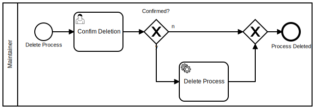

class:
background-image: url(img/explore.jpg)

---
name: about
class: left
background-image: url(img/about.jpg)

.right-column[
Open Minded

|> Science

|> Craftsman

.footnote[
<i class="fab fa-github-square fa-2x"></i> [cmg-dev](https://github.com/cmg-dev)

<i class="fab fa-twitter-square fa-2x"></i> [@codethonian](https://twitter.com/codethonian)
]
]

---
name: introduction
class: middle, center
background-image: url(img/space.jpg)

.regular[
# Advanced Microservices
]

---
name: introduction
class: center, middle
background-image: url(img/space.jpg)

.regular[
# Advanced Microservices

## 1. Advices
## 2. A New Idea
## 3. Technical Topics
]

---
name: introduction
class: left, middle
background-image: url(img/space.jpg)

.regular[
# Advices
]

---
name: introduction
class: left, middle
background-image: url(img/space.jpg)

.regular[
# Advices
.page_right[

]
]
.footnote[
<i class="fa fa-link fa-1x"></i> [XKCD](https://xkcd.com/1988)
]

---
name: introduction
class: left, middle
background-image: url(img/space.jpg)

.page_left[
# An Interesting Age

<i class="fab fa-instagram fa-1x"></i> [Instagram](https://www.instagram.com)
<i class="fab fa-pinterest fa-1x"></i> [Netflix](https://www.nginx.com/blog/microservices-at-netflix-architectural-best-practices/)
<i class="fab fa-whatsapp fa-1x"></i> [Whatsapp](https://www.fastcompany.com/3026758/inside-erlang-the-rare-programming-language-behind-whatsapps-success)
<i class="fab fa-sap fa-1x"></i> [SAP](https://news.sap.com/germany/vorteile-von-microservices/)

]
.footnote[
<i class="fa fa-link fa-1x"></i> [12 Factor](https://12factor.net/de/)
]

---
name: introduction
class: left, middle
background-image: url(img/space.jpg)

.page_left[
# An Interesting Age

<i class="fab fa-instagram fa-1x"></i> [Instagram](https://www.instagram.com) Python (Django) Monolith.

<i class="fab fa-pinterest fa-1x"></i> [Netflix](https://www.nginx.com/blog/microservices-at-netflix-architectural-best-practices/) Well documented Microservice structure.

<i class="fab fa-whatsapp fa-1x"></i> [Whatsapp](https://www.fastcompany.com/3026758/inside-erlang-the-rare-programming-language-behind-whatsapps-success) Monolithic structure; started out in Erlang.

<i class="fab fa-sap fa-1x"></i> [SAP](https://news.sap.com/germany/vorteile-von-microservices/) SAP Hana and Hybris as Cloud Microservice as a Service.

]

---
name: motivation
class: left, middle
background-image: url(img/extinct.jpg)

.regular[
# What is a Microservice?

> The term "Microservice Architecture" (...) describe[s] a
> particular way of designing software applications as suites of
> independently deployable services. While there is no precise
> definition of this architectural style, there are certain common
> characteristics around (...) business capability, automated
> deployment, intelligence in the endpoints, and decentralized
> control of languages and data. [1]

So we are not sure.
]

.footnote[
<i class="fa fa-link fa-1x"></i> [1]: https://www.martinfowler.com/articles/microservices.html
]

---
name: motivation
class: left, middle
background-image: url(img/extinct.jpg)

.regular[
# Where Does it Come From?

]

---
name: motivation
class: left, middle
background-image: url(img/extinct.jpg)

.regular[
# Eric Raymond’s 17 Unix Rules
1. Rule of Modularity
1. Rule of Composition
1. Rule of Separation
1. Rule of Simplicity

(...)
]

???
1. Rule of Modularity

   Developers should build a program out of simple parts connected by well
   defined interfaces, so problems are local, and parts of the program can be
   replaced in future versions to support new features. This rule aims to save
   time on debugging code that is complex, long, and unreadable.

1. Rule of Composition

   Developers should write programs that can communicate easily with other
   programs. This rule aims to allow developers to break down projects into
   small, simple programs rather than overly complex monolithic programs.

1. Rule of Separation

   Developers should separate the mechanisms of the programs from the policies
   of the programs; one method is to divide a program into a front-end
   interface and a back-end engine with which that interface communicates. This
   rule aims to prevent bug introduction by allowing policies to be changed
   with minimum likelihood of destabilizing operational mechanisms.

1. Rule of Simplicity

   Developers should design for simplicity by looking for ways to break up
   program systems into small, straightforward cooperating pieces. This rule
   aims to discourage developers’ affection for writing “intricate and
   beautiful complexities” that are in reality bug prone programs.

---
name: motivation
class: left, middle
background-image: url(img/extinct.jpg)

.regular[
1. Rule of Robustness
1. Rule of Transparency
1. Rule of Parsimony
]

???

1. Rule of Parsimony

   Developers should avoid writing big programs. This rule aims to prevent
   overinvestment of development time in failed or suboptimal approaches caused
   by the owners of the program’s reluctance to throw away visibly large pieces
   of work. Smaller programs are not only easier to write, optimize, and
   maintain; they are easier to delete when deprecated.

1. Rule of Transparency

   Developers should design for visibility and discoverability by writing in a
   way that their thought process can lucidly be seen by future developers
   working on the project and using input and output formats that make it easy
   to identify valid input and correct output. This rule aims to reduce
   debugging time and extend the lifespan of programs.

1. Rule of Robustness

   Developers should design robust programs by designing for transparency and
   discoverability, because code that is easy to understand is easier to stress
   test for unexpected conditions that may not be foreseeable in complex
   programs. This rule aims to help developers build robust, reliable products.

(...)

<!-- 1. Rule of Representation -->

<!--    Developers should choose to make data more complicated rather than the -->
<!--    procedural logic of the program when faced with the choice, because it is -->
<!--    easier for humans to understand complex data compared with complex logic. -->
<!--    This rule aims to make programs more readable for any developer working on -->
<!--    the project, which allows the program to be maintained. -->

<!-- 1. Rule of Least Surprise -->

<!--    Developers should design programs that build on top of the potential users' -->
<!--    expected knowledge; for example, ‘+’ in a calculator program should always -->
<!--    mean 'addition'. This rule aims to encourage developers to build intuitive -->
<!--    products that are easy to use. -->

<!-- 1. Rule of Silence -->

<!--    Developers should design programs so that they do not print unnecessary -->
<!--    output. This rule aims to allow other programs and developers to pick out -->
<!--    the information they need from a program's output without having to parse -->
<!--    verbosity. -->

<!-- 1. Rule of Repair -->

<!--    Developers should design programs that fail in a manner that is easy to -->
<!--    localize and diagnose or in other words “fail noisily”. This rule aims to -->
<!--    prevent incorrect output from a program from becoming an input and -->
<!--    corrupting the output of other code undetected. -->

---
name: motivation
class: left, middle
background-image: url(img/extinct.jpg)

.regular[
## Mike Gancarz: The UNIX Philosophy

1. Small is beautiful.
1. Make each program do one thing well.
1. Build a prototype as soon as possible.
1. Choose portability over efficiency.
1. Store data in flat text files.
1. Use software leverage to your advantage.
1. Use shell scripts to increase leverage and portability.
1. Avoid captive user interfaces.
1. Make every program a filter.
]
.footnote[
<i class="fa fa-link fa-1x"></i> [The Unix Philosophy](
https://en.wikipedia.org/w/index.php?title=Unix_philosophy&oldid=841228158#Mike_Gancarz:_The_UNIX_Philosophy
)
]

???
In 1994, Mike Gancarz (a member of the team that designed the X Window System),
drew on his own experience with Unix, as well as discussions with fellow
programmers and people in other fields who depended on Unix, to produce The
UNIX Philosophy which sums it up in 9 paramount precepts:

---
name: motivation
class: left, middle
background-image: url(img/space.jpg)

.regular[
## How Does it Look Like?
]

---
name: introduction
class: left, middle
background-image: url(img/tidy_stack_small.jpg)

.regular[
# Advices - Summary

1. Do 12 Factor Apps.

2. Know the Unix philosophy.

3. Design good APIs.

4. Use a centralized logging.

6. Communication is key.
]

---
name: introduction
class: left, middle
background-image: url(img/tellerrand.jpg)

.regular[
# Advices

Have a look at:

http://isa-principles.org/index.html
http://scs-architecture.org/

]

---
name: introduction
class: left, middle
background-image: url(img/idea.jpg)

.regular[
# A New Idea
]

---
name: introduction
class: left, middle
background-image: url(img/idea.jpg)

.regular[
## A New Idea

Processes as

1. center of communication.
1. documentation.
1. base for Microservices.
]

---
background-image: url(img/company_clouds.jpg)

---
name: introduction
class: left, middle
background-image: url(img/company_clouds.jpg)

.regular[
## What Have We Done?

]

---
name: introduction
class: left, middle
background-image: url(img/company_clouds.jpg)

.regular[
## Bring it to Life! With an Orchestration

]

---
background-image: url(img/thunder.jpg)

---
name: introduction
class: left, middle
background-image: url(img/thunder.jpg)

.regular[
## We Lost the Connection to the Business
]

---
background-image: url(img/people_boss.jpg)

---
name: motivation
class: left, middle
background-image: url(img/people_boss.jpg)

.regular[
## Boss Thinks

Moeny Money Money.
]

---
background-image: url(img/people_dev.jpg)

---
name: motivation
class: left, middle
background-image: url(img/people_dev.jpg)

.regular[
## Developer Thinks

Code Code Code.
]

---
background-image: url(img/people_op.jpg)

---
name: motivation
class: left, middle
background-image: url(img/people_op.jpg)

.regular[
## Operator Thinks

OMG. Mess. Help.
]

---
background-image: url(img/work_together.jpg)

---
name: motivation
class: left, middle
background-image: url(img/work_together.jpg)

.regular[
## Work Together, How?

Find a common language. This is hard.
]

---
name: motivation
class: left, middle
background-image: url(img/business_case.jpg)

.regular[
## Argument for Processes
]

---
name: motivation
class: left, middle
background-image: url(img/business_case.jpg)

.regular[
## Argument for Processes

Wait, what about the Rules?

1. Rule of Transparency
1. Rule of Parsimony
1. Rule of Generation
1. Rule of Optimization
]
.footnote[
<i class="fa fa-link fa-1x"></i> [From 17 Unix Rules](https://en.wikipedia.org/w/index.php?title=Unix_philosophy&oldid=841228158#Eric_Raymond%E2%80%99s_17_Unix_Rules)
]

???

1. Rule of Generation

   Developers should avoid writing code by hand and instead write abstract
   high-level programs that generate code. This rule aims to reduce human
   errors and save time.

1. Rule of Optimization

   Developers should prototype software before polishing it. This rule aims to
   prevent developers from spending too much time for marginal gains.

1. Rule of Diversity

   Developers should design their programs to be flexible and open. This rule
   aims to make programs flexible, allowing them to be used in ways other than
   those their developers intended.

1. Rule of Extensibility

   Developers should design for the future by making their protocols
   extensible, allowing for easy plugins without modification to the program's
   architecture by other developers, noting the version of the program, and
   more. This rule aims to extend the lifespan and enhance the utility of the
   code the developer writes.

---
name: motivation
class: left, top
background-image: url(img/business_case.jpg)

.regular[
## Argument for Processes

]

---
name: motivation
class: left, top
background-image: url(img/business_case.jpg)

.regular[
## Argument for Processes

]

---
name: motivation
class: left, top
background-image: url(img/business_case.jpg)

.regular[
## Argument for Processes

]

---
name: motivation
class: center, middle
background-image: url(img/business_case.jpg)

---
name: motivation
class: center, middle
background-image: url(img/business_case.jpg)

---
name: motivation
class: center, middle
background-image: url(img/business_case.jpg)

---
name: motivation
class: left, middle
background-image: url(img/business_case.jpg)

.regular[
## Argument for Processes

Processes are probably a good idea.

It will bring us to our common goal.
]

---
name: demo
class: left
background-image: url(img/solo_1.jpg)

.left-column[
# Livecoding Fun

**Let's design a process together...**
]

---
background-image: url(img/together.jpg)

---
background-image: url(img/final_scene.jpg)

---
name: motivation
class: center, middle
background-image: url(img/together.jpg)

.regular[
## Boss == Developer == Operator

### Money. Money. Money.
]

---
name: introduction
class: left
background-image: url(img/workshop_garage.jpg)

---
name: introduction
class: left, middle
background-image: url(img/pilot.jpg)

.left-column[
# Container Pilot Pattern

<!-- Link for containerpilot_architecture.png -->
<!-- http://container-solutions.com/containerpilot-on-mantl/ -->
]

---
name: introduction
class: left, middle
background-image: url(img/cinema.jpg)

.regular[
# Summary and Story Time
]

---
name: introduction
class: left, middle
background-image: url(img/cinema.jpg)

.regular[
## Summary and Story Time

1. We want to be fault tolerant.
1. Dependencies are all transparent.
1. Failures are just changes.
1. We want to scale.
]

---
name: introduction
class: center, middle
background-image: url(img/pilot.jpg)

---
name: introduction
class: left, middle
background-image: url(img/pilot.jpg)

.regular[
1. preStart - to initialize the microservice (e.g. to create configuration files).
1. preStop/postStop - to perform a cleanup right before or after main process stopped.
1. health - to periodically check if the application behaves as expected.
1. onChange - whenever a dependency changes its state.
]

---
name: introduction
class: center, middle
background-image: url(img/pilot.jpg)

---
name: introduction
class: left, middle
background-image: url(img/pilot.jpg)

.regular[
## What Do We Have?

1. nginx - nginx server rendering static assets
1. consul - service catalog used to keep track of registered services
1. hello - Node.js service responding with the word "Hello"
1. world - Node.js service responding with the word "World"
]

---
name: demo
class: left, middle
background-image: url(img/solo_1.jpg)

.regular[
# Livedemo Fun

**Let's check out the ContainerPilot Pattern...**
]

---
name: explore
class: left, middle
background-image: url(img/playground.jpg)

.regular[
# Let's Play Together...

<i class="fa fa-link fa-1x"></i> [7. Juni. 2018 Coding Dojo](https://www.meetup.com/de-DE/5Minds-Coding-Dojo/events/250814256)
]

---
name: explore
class: left, middle
background-image: url(img/curious.jpg)

.page_left[
#... stay Curious!
]

---
name: explore
class: left, middle
background-image: url(img/tools.jpg)

.example_page_left[
#... stay Curious!
]

---
name: explore
class: left, middle
background-image: url(img/first_success.png)

.example_page_left[
#... stay Curious!
]
